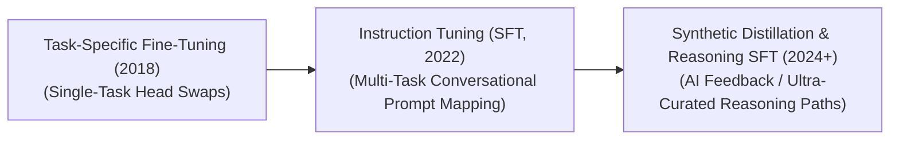

# Awesome-Supervised-Fine-Tuning
## Supervised Fine-Tuning (SFT): Evolution, Variants, Types, & Applications

Supervised Fine-Tuning (SFT) is a critical alignment phase in the lifecycle of Large Language Models (LLMs). While base models undergo massive self-supervised pre-training to learn general language structures, statistical world data, and next-token prediction syntax, they are inherently unaligned for human instruction following—often completing a prompt with more questions or repeating text. SFT bridges this gap by training the frozen or unlocked base architecture on a highly curated dataset of high-quality, human- or AI-generated demonstrations (Prompt-Response pairs). By optimizing the network using a standard cross-entropy loss function on the target tokens, SFT instills task formatting, instruction adherence, conversational personas, and tool-calling capabilities.

---

## 1. The Chronological Evolution

The technical execution of supervised model tuning has shifted from full parameter modification on specialized tasks to foundational dialogue alignment and automated synthetic instruction generation.

| Era | Concept & Limitations | First Used (Year) | Origin Paper |
| :--- | :--- | :---: | :--- |
| **The Task-Specific Tuning Era (~2018–2021)** | **Concept:** Popularized by models like BERT and RoBERTa. Fine-tuning meant chopping off the base model's terminal layers, appending a task-specific classification head, and updating parameters over isolated datasets for single, narrow capabilities (e.g., Named Entity Recognition or Sentiment Analysis).  **Limitation:** Rendered the model a single-purpose tool, destroying its general generative properties. | 2018 | [BERT (Devlin et al., 2018)](https://arxiv.org/abs/1810.04805) |
| **The Multi-Task Instruction Tuning Era (~2022–2024)** | **Concept:** Pioneered by Google’s FLAN and OpenAI’s InstructGPT. It replaced specialized task heads with uniform natural language prompts. Models were fine-tuned across thousands of distinct tasks simultaneously using conversational dialogue formats, unlocking cross-task generalization and creating the first stable "chatbots."  **Limitation:** Reliant on expensive, crowd-sourced human labelers, which introduced data quality bottlenecks and formatting inconsistencies. | 2021 | [FLAN (Wei et al., 2021)](https://arxiv.org/abs/2109.01652) |
| **The Synthetic Ultra-Curated & Reasoning Era (~2024–Present)** | **Concept:** The current state-of-the-art framework. Moves away from vast, noisy human data arrays toward highly filtered **Self-Instruct** frameworks and **Reasoning Data SFT** (e.g., DeepSeek-R1 cold-start data). Highly precise frontier models generate structural, error-free reasoning traces, pseudocode blocks, or mathematical proofs to train compact networks directly. | 2022 / 2025 | [Self-Instruct (Wang et al., 2022)](https://arxiv.org/abs/2212.10560) / [DeepSeek-R1 (DeepSeek-AI, 2025)](https://arxiv.org/abs/2501.12948) |

---

## 2. Core Architectural & Parameter Variants

SFT routines vary based on whether they optimize the entire model footprint or preserve the core weights via parameter-efficient tracking layers.

| Variant | Mechanism & Key Characteristics | First Used (Year) | Origin Paper |
| :--- | :--- | :---: | :--- |
| **Full Fine-Tuning (Full Parameter SFT)** | **Mechanism:** Every single weight tensor across all layers of the deep neural network graph is unlocked and adjusted during backpropagation.  **Pros:** Maximizes the model's capacity to absorb complex, domain-specific vocabularies or entirely new behavioral personas.  **Cons:** Susceptible to **Catastrophic Forgetting** and requires immense VRAM infrastructure to host full size gradient tracking arrays. | 2018 | [BERT (Devlin et al., 2018)](https://arxiv.org/abs/1810.04805) |
| **Parameter-Efficient Fine-Tuning (PEFT / LoRA SFT)** | **Mechanism:** Freezes the base model parameters entirely, injecting low-rank adapter matrices ($A$ and $B$) into self-attention blocks to track weight adjustments.  **Significance:** Reduces downstream storage demands from gigabytes to megabytes per custom task, permitting effortless model swapping in multi-tenant SaaS production loops. | 2021 | [LoRA (Hu et al., 2021)](https://arxiv.org/abs/2106.09685) |
| **Quantized PEFT (QLoRA SFT)** | **Mechanism:** Bakes the parameter adapters directly on top of a base model compressed into an optimized 4-bit NormalFloat (NF4) data type, utilizing page-to-page memory structures to prevent Out-Of-Memory training crashes. | 2023 | [QLoRA (Dettmers et al., 2023)](https://arxiv.org/abs/2305.14314) |

---

## 3. Data Modality & Prompt Ingestion Types

Depending on how instructions are curated, sequenced, and packed during the preprocessing pipeline, SFT follows distinct functional data paradigms.

| Data Ingestion Type | Data Profile & Behavior | First Used (Year) | Origin Paper |
| :--- | :--- | :---: | :--- |
| **Human Demonstration SFT** | **Data Profile:** Highly authentic conversational scripts hand-written or audited by human crowd-sourcers or domain experts (e.g., certified doctors writing medical responses).  **Behavior:** Critical for establishing high empathy, polite conversational boundaries, and natural human styling. | 2022 | [InstructGPT (Ouyang et al., 2022)](https://arxiv.org/abs/2203.02155) |
| **Distillation / RLAIF SFT (AI Feedback)** | **Data Profile:** Text data generated programmatically by querying a multi-billion parameter frontier model via prompt expansion networks (e.g., using GPT-4o to generate 50,000 synthetic Python instruction scenarios).  **Behavior:** Delivers exceptional logical precision, high formatting consistency, and structured markdown alignment. | 2022 | [Constitutional AI (Bai et al., 2022)](https://arxiv.org/abs/2212.08073) |
| **Process-Oriented Reasoning SFT** | **Data Profile:** Focuses on "thinking text blocks." Prompt maps are appended with explicit step-by-step validation markers, self-correction loops, and alternative hypothesis checkpoints.  **Behavior:** Acts as the mandatory "cold-start" initialization phase for reasoning models before they enter reinforcement learning (RL) search loops. | 2023 | [Let's Verify Step by Step (Lightman et al., 2023)](https://arxiv.org/abs/2305.20050) |

---

## 4. Production Engineering Challenges & Mitigations

Executing large-scale SFT loops in real-world enterprise architectures requires balancing optimization boundaries and padding efficiencies.

| Challenge | Problem & Mitigation | First Used (Year) | Origin Paper |
| :--- | :--- | :---: | :--- |
| **The Sequence Padding Inefficiency Barrier** | **The Problem:** Prompt lengths are highly irregular. Placing varying conversation sizes inside a uniform batch forces the system to pad out shorter strings with massive arrays of trailing `[PAD]` zeros, wasting up to 50% of GPU compute time reading blank text.  **Mitigation:** Implementing **Document Packing** (utilizing tools like FlashAttention or Axolotl). Multiple short user conversations are stitched sequentially into a single long tensor block up to the model's exact context length, using specialized attention masks to block cross-document contamination. | 2021 | [Sequence Packing (Krell et al., 2021)](https://arxiv.org/abs/2107.02027) |
| **The Data Quality vs. Quantity Dilemma** | **The Problem:** Early pipelines assumed scaling up quantity (e.g., 1 million noisy data rows) yielded better alignment. Research (such as the LIMA paper) proved that vast, unverified datasets actively corrupt model capability, leading to output repetition.  **Mitigation:** Moving to a **"Less is More" filtering approach**, using strict algorithmic scoring rules to trim data pools down to fewer than 10,000 pristine, information-dense, and structurally flawless instruction examples. | 2023 | [LIMA (Zhou et al., 2023)](https://arxiv.org/abs/2305.11206) |

---

## 5. Frontier Real-World Applications

| Application | Description & Details | First Used (Year) | Origin Paper |
| :--- | :--- | :---: | :--- |
| **Enterprise Tool-Calling & API Function Injection** | **Application:** Fine-tunes an internal base model to parse natural user intent and cleanly convert it into valid JSON objects matching strict software backend documentation (e.g., calling an internal SQL data tracking API dynamically). | 2023 | [Toolformer (Schick et al., 2023)](https://arxiv.org/abs/2302.04761) |
| **Structured Customer Service Persona Formatting** | **Application:** Aligns a raw base model to act as a specialized brand representative. SFT forces the system to output safe, politeness-bounded responses using clean markdown formatting, lists, and summary charts while suppressing raw data dumps. | 2022 | [InstructGPT (Ouyang et al., 2022)](https://arxiv.org/abs/2203.02155) |
| **Domain-Specific Corporate Localization (Legal/Medical)** | **Application:** Tailors open-weights systems to handle technical data. By fine-tuning models over long-form legal case documents or structured clinical charts, the SFT layer conditions the network to parse specialized jargon without fracturing syntax patterns. | 2019 | [BioBERT (Lee et al., 2019)](https://arxiv.org/abs/1901.08746) |

