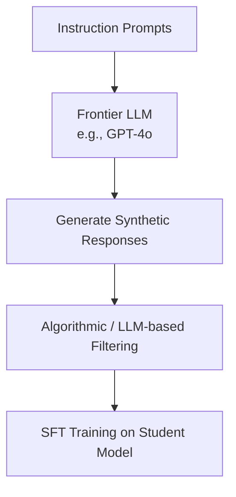

# Distillation / RLAIF SFT (AI Feedback)

Distillation or RLAIF (Reinforcement Learning from AI Feedback) SFT utilizes outputs from frontier LLMs as target datasets for training smaller student models.

## Concept
Instead of human annotators, a larger model (e.g., GPT-4o) generates responses to instruction prompts. These responses are filtered, structured, and used to train a smaller model. This process distills the reasoning and formatting capabilities of the larger model into the smaller one.

## Benefits
* **High Formatting Consistency**: Promotes strict adherence to structured markdown outputs, JSON, or pseudocode.
* **Scalability**: Substantially cheaper and faster than human-based curation pipelines.

[← Back to README](../README.md)
