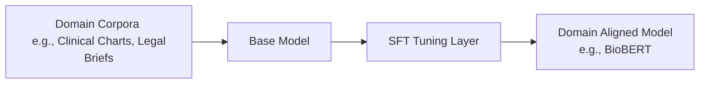

# Domain-Specific Corporate Localization (Legal/Medical)

Domain-Specific Corporate Localization is the process of adapting pre-trained models to handle specialized technical vocabularies and reasoning patterns.

## Concept
Standard base models often struggle with complex medical clinical charts or dense legal case work. By fine-tuning models over curated corpora of medical files or legal drafts, SFT teaches the model domain-specific terminology, citation syntax, and analytical structure without fracturing its general conversational ability.

[← Back to README](../README.md)
