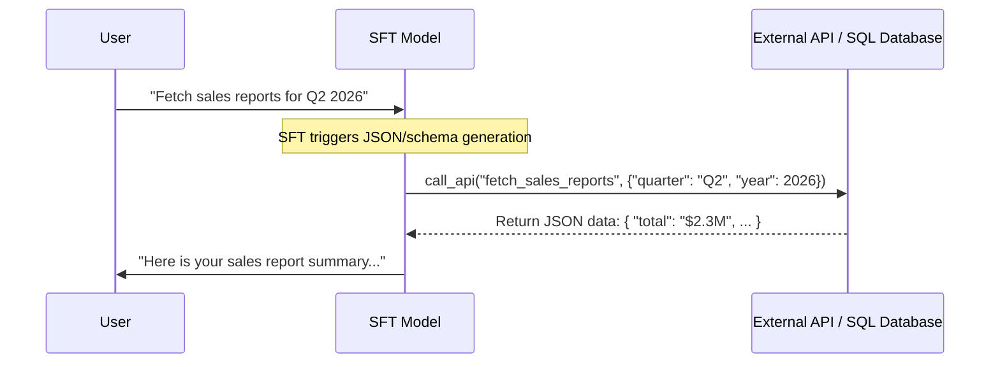

# Enterprise Tool-Calling & API Function Injection

Enterprise Tool-Calling aligns base models to parse natural language queries and dynamically construct valid structured queries or API payloads.

## Concept
During SFT, the model is trained to recognize when a user query requires external data (e.g., fetching user details, executing SQL, or calling an API). The model learns to output structured JSON or tool-call blocks that match a pre-defined API schema.

[← Back to README](../README.md)
