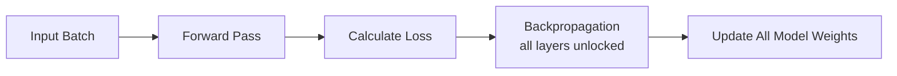

# Full Fine-Tuning (Full Parameter SFT)

Full Fine-Tuning is the process of updating every single weight tensor across all layers of a deep neural network during the supervised alignment phase.

## Mechanism
Unlike parameter-efficient methods, Full SFT unlocks the entire model footprint. Backpropagation calculates gradients for every weight, and the optimizer updates all parameters.

## Trade-offs
* **Pros**: Maximizes the model's capacity to absorb complex, domain-specific vocabularies and adapt its core behavior.
* **Cons**: Susceptible to **Catastrophic Forgetting** (where the model loses general pre-training knowledge) and requires substantial VRAM to store optimizer states for every parameter.

[← Back to README](../README.md)
