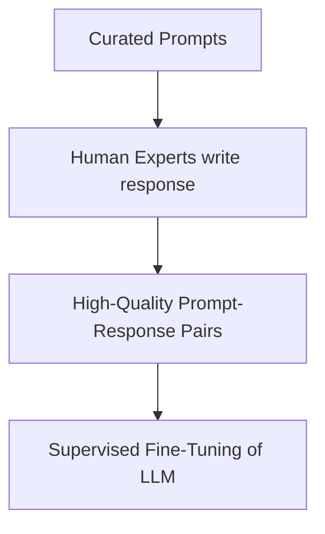

# Human Demonstration SFT

Human Demonstration SFT is the traditional method of aligning LLMs using instruction datasets curated, written, or audited by human annotators.

## Concept
In this paradigm, human experts draft prompts along with ideal, detailed responses. These high-fidelity pairs serve as the training target. Human demonstration SFT is crucial for setting tone, alignment boundaries, helpfulness, and safety guidelines.

## Characteristics
* **Empathy & Conversational Styling**: Establishes natural phrasing, politeness, and structured corporate boundaries.
* **Limitations**: Highly expensive, slow to gather, and prone to human error or formatting inconsistencies.

[← Back to README](../README.md)
