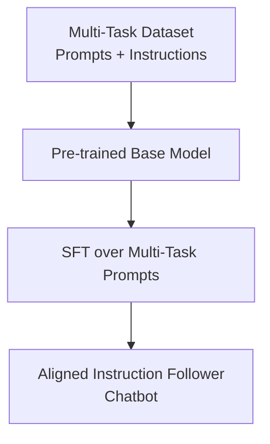

# Multi-Task Instruction Tuning Era (~2022–2024)

Multi-Task Instruction Tuning represents a paradigm shift where models are aligned to follow human instructions across a wide range of tasks simultaneously, rather than learning a single narrow function.

## Concept
Pioneered by Google's FLAN and OpenAI's InstructGPT, this approach replaces task-specific heads with natural language prompts. The model is fine-tuned on a collection of diverse tasks formatted as "Prompt-Response" pairs. This teaches the model the general format of "instruction following," enabling zero-shot and few-shot generalization to unseen tasks.

## Limitations
* **Human Labeling Bottleneck**: The process heavily relies on expensive, crowd-sourced human annotations, which can introduce formatting inconsistencies and scalability limits.

[← Back to README](../README.md)
