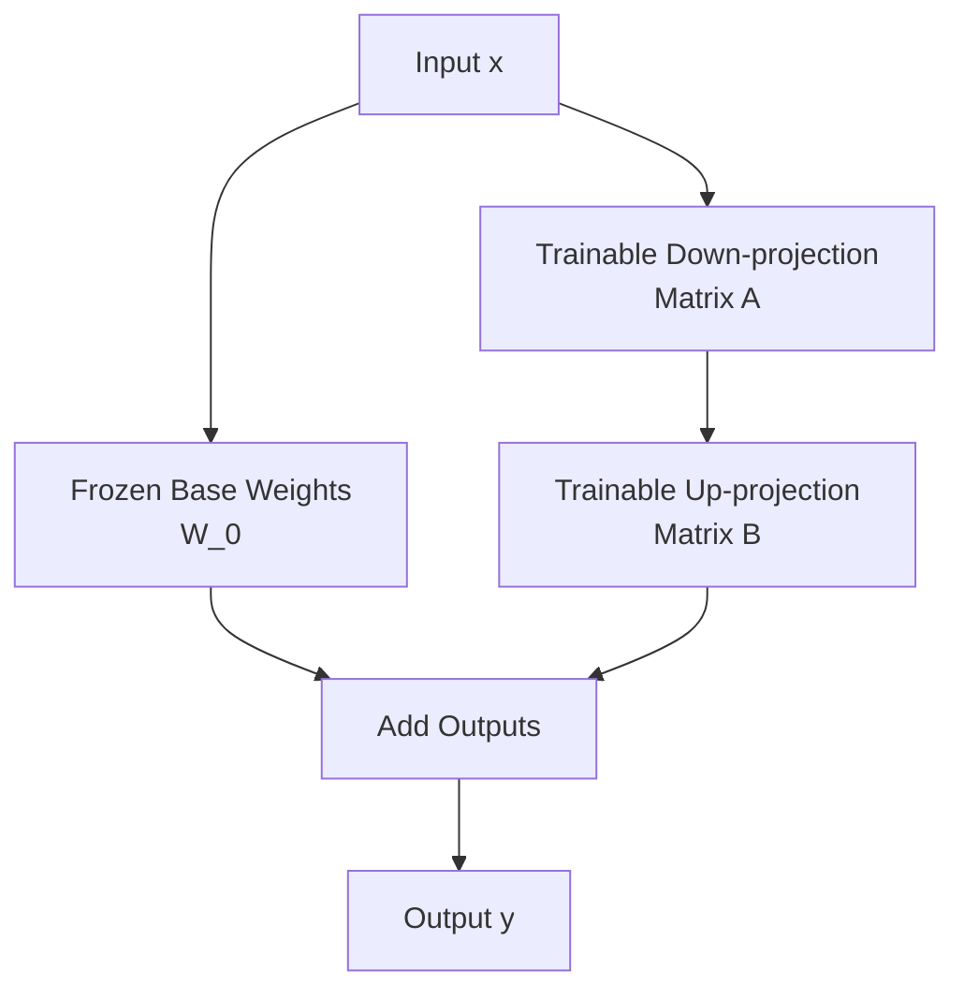

# Parameter-Efficient Fine-Tuning (PEFT / LoRA SFT)

LoRA (Low-Rank Adaptation) is a parameter-efficient fine-tuning technique that allows adapting large models without modifying their pre-trained weights.

## Mechanism
LoRA freezes the base model weights and injects trainable rank decomposition matrices (matrix $A$ and matrix $B$) into the self-attention blocks. During training, only these adapter matrices are updated, which significantly reduces the parameter footprint.

## Benefits
* **Reduced Storage**: Storing only adapter weights (megabytes) rather than full model weights (gigabytes).
* **Multi-Tenant Serving**: Effortless model swapping by switching adapters at runtime while keeping a single copy of the base model in GPU memory.

[← Back to README](../README.md)
