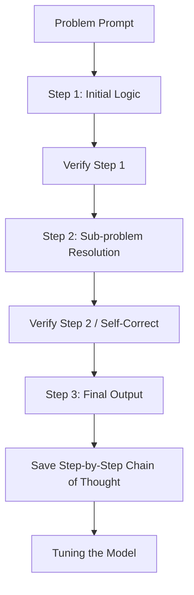

# Process-Oriented Reasoning SFT

Process-Oriented Reasoning SFT focuses on teaching models *how to think* step-by-step, rather than just matching a final outcome.

## Concept
In process-oriented training, intermediate steps (reasoning traces) are generated and evaluated. Models are trained on data where each logical step is explicitly laid out and verified. This serves as a critical "cold-start" alignment phase for reasoning architectures prior to RL optimization.

[← Back to README](../README.md)
