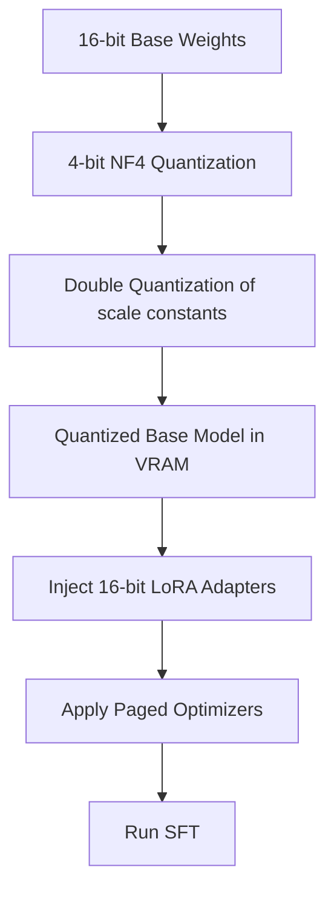

# Quantized PEFT (QLoRA SFT)

QLoRA (Quantized Low-Rank Adaptation) is an optimization technique that reduces the memory required for SFT by combining model quantization with PEFT adapters.

## Mechanism
QLoRA quantizes the pre-trained base model to a specialized 4-bit NormalFloat (NF4) data type. LoRA adapters are then added on top. QLoRA introduces three key memory saving features:
1. **NF4 Quantization**: An information-theoretically optimal quantization type for normally distributed weights.
2. **Double Quantization**: Quantizing the quantization constants themselves to save additional memory.
3. **Paged Optimizers**: Utilizing NVIDIA unified memory to prevent Out-Of-Memory page faults during gradient surges.

[← Back to README](../README.md)
