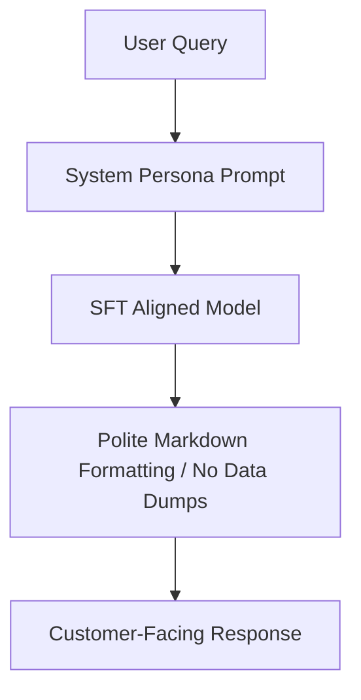

# Structured Customer Service Persona Formatting

Structured Customer Service Persona Formatting aligns a raw base model to act as a specialized brand representative.

## Concept
Through targeted SFT, the model learns to maintain polite conversational boundaries, output answers using clean markdown formatting, lists, and summary charts, and suppress raw unstructured data dumps or unsafe content.

## Practical Application
Ensures corporate chatbots adhere to brand guidelines, follow safety boundaries, and present information in structured markdown (e.g., tables and bulleted highlights).

[← Back to README](../README.md)
