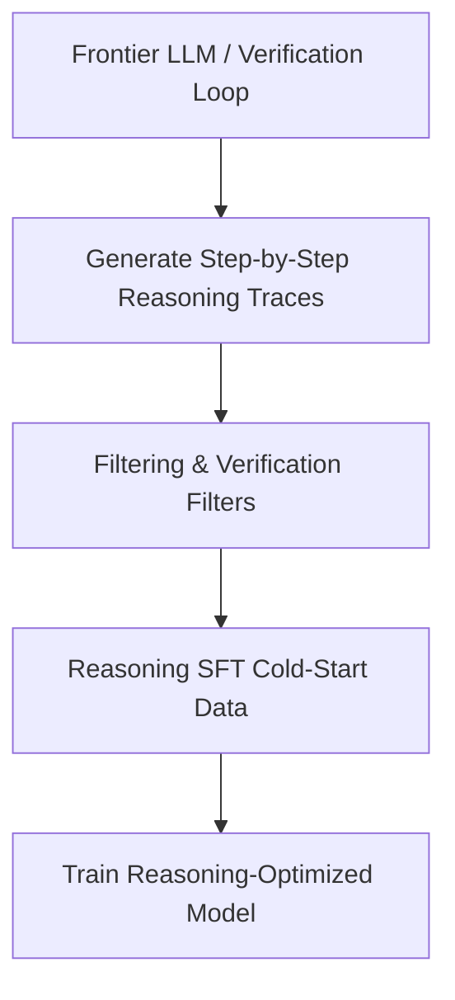

# Synthetic Ultra-Curated & Reasoning Era (~2024–Present)

The current state-of-the-art SFT paradigm leverages high-quality, synthetically generated reasoning data rather than noisy human annotations to train language models.

## Concept
Instead of scaling data volume, this era focuses on the quality of step-by-step reasoning traces. Stronger frontier models (or specialized verification pipelines) generate structural, error-free reasoning traces, pseudocode, and proofs. These reasoning paths serve as "cold-start" SFT data for reasoning-focused architectures (such as DeepSeek-R1).

[← Back to README](../README.md)
