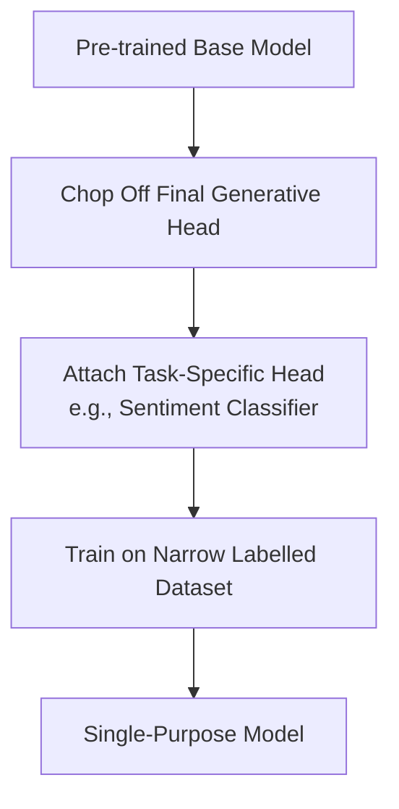

# Task-Specific Fine-Tuning Era (~2018–2021)

Task-Specific Fine-Tuning represents the early era of adaptation for pre-trained language models. Pioneered by models such as BERT and RoBERTa, this method involves modifying the architecture of a pre-trained model to perform a single, narrow task.

## Mechanism
During this era, practitioners would take a pre-trained base model, remove its general-purpose token prediction head, and attach a new task-specific head (e.g., a simple linear classifier for sentiment analysis or named entity recognition). The entire network (or just the terminal layers) would then be trained on a labelled dataset dedicated to that specific task.

## Limitations
* **Destroyed Generative Properties**: The model loses its ability to generate general-purpose text or perform other tasks.
* **Architecture Proliferation**: Practitioners had to maintain separate model weights for every distinct downstream task.

[← Back to README](../README.md)
